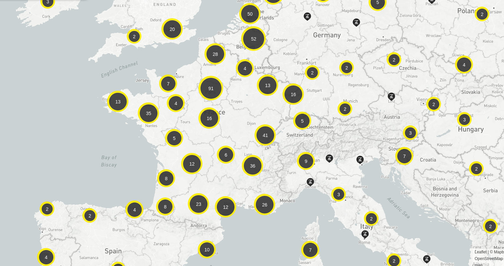

> Date de Création : 20 septembre 2020 
> Auteur : Lilian Tribouilloy 
> Licence : Creative Commonces BY SA 

# Donner Envie au Débutant

## De quoi a‑t‑on besoin pour débuter l’électronique ?

Ce chapitre est un petit guide pour celui qui souhaite découvrir l’électronique (et ce qui tourne autour).

Il n’a pas vocation à être parfaitement pédagogique, ni exhaustif.
Mais il donne une idée de l’investissement en temps et en argent nécessaire. Et ceci pour vous permettre de voir si vous êtes prêt à aller plus loin. (On ne va pas vous mentir l’électronique est une discipline difficile et chronophage)

Et si d’aventure vous êtes motivé, cela vous aide à construire votre boite à outil. On donne une indication approximative du prix ou sinon il faudrai aller voir la disponibilité dans quelques fablabs ou autres lieux ou associations.

## Les Marges de Progression

### Préalable indispensable
Le minimum que nous impose la modernité de notre société si on veut accéder à des informations et des outils à moindre coût.

* Ordinateur
* Connexion internet

Mais si vous êtes arrivé ici, c’est que selon toute vraisemblance vous disposez déjà de cela.

L’adhésion à un fablab, makerspace, hackerspace ou autres types de club de bricolage peut être un soutien fort appréciable pour le soutien communautaire et pour le prêt ou la location d’outillage.

### Niveau 0 ; Prix = 0€
Pour goûter sans dépenser.
Que du logiciels libre, gratuit et disponible sur tous les OS.
Des sources d’information pédagogique.
Des exemples de projet pour motiver.

* Logiciels pour l’Électronique : 
	- Kicad, éditeur de schéma électronique et routage de circuit imprimé
	- LT Spice, simulation base fréquence (pas dispo sur Linux)
	- QUCS, simulation haute fréquence et micro‑électronique (attention logiciel difficile)
	- QElectroTech, électricité domestique
	- Fritzing, routage sur carte de test (type breadboard)

__« L’électronique a deux super potes dans sa bande : la programmation et la mécanique. »__

* Logiciels pour la Programmation :
Il y a une grande diversité dans ce domaine. À vous de vous faire votre propre opinion.
	- Éditeur de code généraliste (Gedit, Sublime texte, Visual Studio Code…)
	- IDE pour les cas particuliers (IDE Arduino, Code::Block, Geany…)
	- Éditeur de fichier binaire (GHex, wxHexEditor…)
	- Meld pour comparer 2 codes.

* Langages de programmation recommandés pour le bas niveau (code directement en interaction avec l’électronique)
	- C, le langage de référence en bas niveau
	- C++, le complément « orienté objet » du C. Il est notamment utilisé pour les bibliothèques Arduino
	- Python, un langage de script à l’origine, ce langage a connu une popularité dans plein de domaines y compris en bas niveau avec son extension Micro‑Python.
	- GIT, pour le partage des sources et la gestion des versions

* Logiciels pour la Mécanique :
	- FreeCAD, conception en 3D, type paramétrique, génération de Gcode pour l’usinage.
	- LibreCAD, conception en 2D (attention prise en main difficile), manipulation de fichier DXF.
	- CAMotics, pour simuler le parcours d’une CNC.

* Logiciels divers de Dessin et Bureautique :
Ce qui peut être nécessaire en complément dans certain cas.
	- Gimp, dessin matriciel, retouche photo.
	- Inkscape, dessin vectoriel, pour donner à la découpe laser.
	- Blender, image de synthèse en 3D, imprimante 3D pour les objets modélisés par maillage.
	- LibreOffice
	- Calculatrice (SpeedCrunch)
	- Prise de note : traditionnel à la main ou informatisé (CherryTree)

* Sites où on trouve du contenu pédagogique
	- Youtube
	- Wikipedia
	- OpenClassRoom
	- https://www.arduino.cc/
	- https://www.tutorialspoint.com/cprogramming/index.htm
	- https://www.tutorialspoint.com/python/index.htm
	- https://les-electroniciens.com/cours-d-electronique
	- https://learngitbranching.js.org/?locale=fr_FR
	- https://github.com/github/opensource.guide/blob/master/_articles/fr/how-to-contribute.md
	- https://guides.github.com/activities/hello-world/
	- …

* Sites où les gens parlent de leurs projets
	- https://www.makery.info/
	- https://www.framboise314.fr/
	- https://create.arduino.cc/projecthub
	- https://ouiaremakers.com/
	- https://projects.fablabs.io/
	- http://libreobjet.org/index.html
	- https://www.lairdubois.fr/
	- https://wikifab.org/wiki/Accueil
	- reddit
	- pinterest
	- …

__Conseil : La curiosité n’a jamais été un défaut.__

### Niveau 1 ; Prix = 100€ à 300€
Vous êtes motivé, vous souhaitez commencer à mettre les mains dans le cambouis.

* Multimètre entrée de gamme (40€ à 60€)
* Un bloc d’alimentation secteur
* Fer à souder entrée de gamme (Dispo au FabLab)
* Outillage à main divers : pince coupante, pince plate, jeux de tournevis…
* Carte de développement : Arduino ou Rapsberry Pi ou autres…
* Composants de base selon le premier petit projet pédagogique (Résistance, LED, condensateur, fil, diodes, transistor…)

Où se procurer du matos :
* Conrad
* Radiospares
* Farnell
* Kubii
* AliExpress
* BangGood
* Mouser
* https://www.polytech-oscilloscopes.com/
* Amazon
* …

__Conseil : Pratiquer régulièrement. N’ayez pas peur de bidouiller et poser des questions.__

### Niveau 2 ; Prix = 100€ à 300€
La passion commence à vous gagner, alors plus de matos général pour étoffer la caisse à outil.

* Un espace bureau adapté avec de quoi ranger le matos. (Quand on commence à bricoler il faut de la place…)
* Pince à dénuder
* Pince brucelle
* Cutter type scalpel
* petite lime ou ponçage
* Divers consommables
* Une station de soudage (on parle de brassage en fait), et les consommables associés.
* Une petite perceuse multifonction (type Dremel)
* 3ième main et/ou petit étaux
* Multiprise
* Un bon éclairage

__Conseil : Trouver vous un projet qui vous passionne, mais abordable selon votre niveau. Vous devez apprendre à apprendre, un fablab n’est pas une école.__

### Niveau 3 ; Prix = 400€ à 1000€
Les choses sérieuses commencent, il vous faut pourvoir débeuger les cartes efficacement.

* Organiser votre espace de travail.
* Alimentation de laboratoire (Dispo au FabLab)
* Analyseur Logique
* Sonde de débeug
* Loupe (mieux sur bras articulé)
* Fer à air chaud
* Thermomètre infrarouge

__Conseil : Lancer vous des défis avec des projets toujours de plus en plus complexe.__

### Niveau 4 ; Prix = 400€ à 1000€
On ne peut plus vous arrêter…

* Oscilloscope (Dispo au FabLab)
* Multimètre de laboratoire
* Microscope binoculaire
* générateur de signal BF (Dispo au FabLab)
* Charge active
* Caméra thermique
* pince ampèremétrique

Où faire fabriquer vos circuits à prix raisonnable ?
* https://jlcpcb.com/ : Le moins chers mais limiter à 6 couches. Et on est très limité sur l’empilage.
* https://www.pcbway.com/ : Plus de configuration possible, mais nettement plus chers.
* https://www.eurocircuits.com/blog/the-history-of-order-pooling/ : Fabriquant européen, service industriel plus facile, mais nettement plus chers.
* Sinon aller dans un fablab qui propose une CNC spécialisée pour les PCB (Printed Circuit Board). Attention, limité à 2 couches.
* Sinon méthode traditionnelle de prototypage : plaque à trous, gravure au perchlorure de fer.

__Conseil : Réaliser vos rêves.__

### Niveau 5 ; prix = 1000€ à 20000€
Vous êtes définitivement un super geek de la mort.

* CNC gravure de PCB
* Imprimante 3D (Dispo au FabLab)
* Découpe laser (Dispo au FabLab)
* Fraiseuse numérique (Dispo au FabLab)
* Four à refusion pour composants CMS miniatures
* Machine pick and place
* Analyseur de spectre
* Analyseur vectoriel de réseaux

__Conseil : Faite de votre passion un métier.__

### Niveau +++
Vers l’infini et au‑delà.

__Conseil : Il ne reste plus qu’à monter votre boîte…     ;-)__

------------------------------------------------------------------------

## Où Trouver de quoi Apprendre ?

### Livres pour Apprendre

#### Post de forum selon Électro-Bidouilleur

http://forum.bidouilleur.ca/index.php?topic=677.0
https://www.youtube.com/watch?v=VEmyw9jPJ4g
« Modifié: janvier 24, 2020, 02:42:18 pm par Électro-Bidouilleur »

Voici une compilation des d'ouvrages d'apprentissage de l'électronique, tels que suggérés par les bidouilleurs sur ce Forum. Ceci n'est évidemment pas une liste exhaustive de tous les ouvrages disponibles ; que les recommandations mentionnés par les bidouilleurs membres du Forum. Si vous désirez ajouter des recommandations à cette liste, veuillez ajouter un message à ce sujet ; je regrouperai toutes les recommandations dans ce message-ci.
Note Légale : Les liens fournis ci-dessous sont réputés être "légaux" et en circulation libre. Si vous avez des informations contraires au sujet d'un de ces liens, veuillez me le faire savoir sans tarder. Merci.

#### Ouvrages pour débutants
“L'électronique pour les nuls", par Cathleen Shamieh. 2ème édition.
Vraiment très accessible et abordable, condensé d'informations pour les composants discrets et aussi sur les circuits intégrés.
Disponible en couleur. Disponible aussi en .PDF.
https://ia801607.us.archive.org/35/items/LelectroniquePourLesNuls2eEditionFirst/L%27%C3%A9lectronique%20Pour%20les%20Nuls%202e%20Edition%20-%20First.pdf

"Arduino pour les nuls", par John Nussey. 2ème édition.
http://www.multimedialab.be/doc/erg/2017-2018/Arduino/Arduino_pour_les_nuls_poche_2e_Edition_Mai_2017.pdf

“Apprendre l’Électronique en Partant de Zéro”.  Une compilation du Cours “Électronique en Partant de Zéro” parus dans les numéros 1 à 79 de la revue ÉLECTRONIQUE et Loisirs magazine.
De l’auteur : Vous permettra de vous familiariser avec le sujet. En partant du courant électrique il vous entraînera à la découverte des composants. Résistances, condensateurs, diodes, transistors, thyristors et autres n’auront plus de secret pour vous. Plusieurs chapitres consacrés à l’apprentissage de la soudure, l’utilisation du multimètre. L’aspect « radio » est également abordé avec une partie réservée aux ondes radioélectriques. Réalisation de montages simples d’alimentations, de récepteurs radio ou d’appareils de mesure. Disponibles seulement en .PDF
Niveau 1 : https://ia601306.us.archive.org/13/items/ApprendreLElectroniqueEnPartantDeZeroNiveau1Lecons01A28_201510/Apprendre%20l%27Electronique%20en%20Partant%20de%20Z%C3%A9ro%20-%20Niveau%201%20-%20Lecons_01%20%C3%A0%2028.pdf
Niveau 2 : https://archive.org/download/ApprendreLElectroniqueEnPartantDeZeroNiveau1Lecons01A28_201510/Apprendre%20l%27%20Electronique%20en%20Partant%20De%20Z%C3%A9ro%20-%20Niveau%202%20-%20Le%C3%A7ons%2029%20%C3%A0%2037.pdf
Niveau 3 :
https://archive.org/download/ApprendreLElectroniqueEnPartantDeZeroNiveau1Lecons01A28_201510/Apprendre%20l%27%20Electronique%20en%20Partant%20de%20Z%C3%A9ro%20-%20Niveau%203%20-%20Le%C3%A7ons%2038%20%C3%A0%2047.pdf

“La radio ? mais c'est très simple!”, par Eugène Aisberg. 29ème édition. Série Nostalgie.
Curiosus : "Je trouve ce livre génial, il y a pas mieux pour commencer à apprendre l'électronique. L'auteur à mis de l'humour pour faire comprendre des choses compliqués, bel exemple pour nos professeurs qui sont parfois trop sérieux, et qui n'attirent plus l'attention des élèves."
https://ia801402.us.archive.org/22/items/la_radio_mais_cest_tres_simple/la_radio_mais_cest_tres_simple.pdf

"Électronique pratique - 2ème édition", par Jacques-Michel Fouchet, Arsène Perez-Mas.
ksyrium : "Lors d'une formation, j'avais eu ce livre. Très bien pour acquérir les bases et plus (avec exercices et corrigés)."
https://www.dunod.com/sciences-techniques/electronique-pratique?gclid=EAIaIQobChMIqrbPu_L-5gIVFYbVCh35dg5bEAQYASABEgJo6fD_BwE

"All New Electronics Self-Teaching Guide", par Harry Kybett et Earl Boysen.
AlanFromJapan : Le graal pour un sérieux débutant, parce qu'il part de zéro et est rempli d'exercices avec correction! Ce fut le plus instructif pour moi, mais tout le monde n'aime pas l'approche académique.

"Electrical Engineering 101 : Everything You Should Have Learned in School...but Probably Didn't", par Darren Ashby.
AlanFromJapan: Loin d'être académique, si vous voulez juste intuiter plus que comprendre, avoir une espèce de raccourci pour apprendre les bases, c'est un bon livre. Par contre si vous préférez apprendre "sérieusement" passez votre chemin.

"NEETS (US Navy electronic courses)".
Saranadze : En anglais mais c'est une mine d'or: Il s'agit d'un cours complet, destiné à des gens qui arrivent dans l’armée sans avoir forcément eu une éducation supérieure, donc écrit de manière à être compréhensible par tout le monde... Et c'est gratuit, facile à trouver :
https://www.fcctests.com/neets/Neets.htm   (juste un exemple)
Plus de détails de la part de Saranadze dans la réponse suivante : http://forum.bidouilleur.ca/index.php?topic=677.msg4106#msg4106

#### Ouvrages de niveau intermédiaire

“The Art of Electronics” 3ème édition, par Paul Horowitz.
Yffig : "Plus de 1500 pages de pur bonheur, même à environ 60/70 € sur Amazon, c'est vraiment vouloir faire des économies de bout de chandelle que de s'en priver. Le site des auteurs offre en téléchargement la totalité de la table des matières et du chapitre 9 sur les Alimentations (135 pages) "VOLTAGE REGULATION AND POWER CONVERSION" https://artofelectronics.net/wp-content/uploads/2016/02/AoE3_chapter9.pdf "
cschopfer : "Juste merveilleux. Sauf son prix..."

“Traité de l’Électronique”, par Paul Horowitz et Winfield Hill.
Oxygene: Basé sur “The Art of Electronics” de Paul Horowitz. Disponible seulement en .PDF :
Volume 1 :
http://sylvain.larribe.free.fr/livres/PDF/Traite_Electronique/Traite_Electronique_V1_S_01_A_I_ocr.pdf
Volume 2 :
http://sylvain.larribe.free.fr/livres/PDF/Traite_Electronique/Traite_Electronique_V2_S_16_17_I_ocr.pdf

"Percer les mystères de l'électronique", par Robert Lacoste. ISBN : 978-2-86661-207-8
Cyrob : Recommandé par Philippe dans une vidéo YouTube : https://www.youtube.com/watch?v=PdrvM3zxy04

#### Ouvrages de référence plus approfondis

“Électronique appliquée aux hautes fréquences” de François de Dieuleveult et Olivier Romain aux éditions Dunod 2ème édition.
Oscillateur88 : "Pour toute personne souhaitant trouve une source fiable, précise, pédagogique et assez accessible pour se renseigner, réviser, ou revoir les concepts de base de l'électronique hautes fréquences : c'est un must have ! Je le trouve très bon de A à Z, tout est expliqué pas à pas par les auteurs, il fait plus de 500 pages je crois (pour 70 euros). Vous pouvez voir le sommaire sur le site de Dunod ou Amazon si ça vous intéresse ; il faut quelques bases pour l'aborder à la fois en électronique et en mathématiques, mais rien de poussé non plus ! Le livre décrit vraiment les bases (solides) de l’électronique hautes fréquences, je le consulte de temps en temps si jamais j'ai besoin d'un rappel."

“Composants pour Télécoms” par François de Dieuleveult.
Oscillateur88 : "Il s'agit d'un livre qui présente les principales fonctions utilisées dans l'électronique des communications. Il coûte 60 euros et ratisse vraiment beaucoup de choses sur : Les amplificateurs, les oscillateurs, les mélangeurs, les modulateurs, les filtres, etc… C'est très orienté théorie et conception, l'auteur développe les concepts avec à chaque fois : une base physique et mathématiques solide suivie d'extraits de simulations sur le logiciel ADS. Le livre est très fourni et assez approfondi. Pour les pratiquants recherchant un ouvrage pouvant les aider à comprendre comment fonctionnent et sont conçus les composants de base."

“Électronique Analogique Composants et Systèmes Complexes” de nombreux auteurs.
Oscillateur88 : "Pour la somme de 50 euros le livre est un peu un équivalent au premier mais pour l'électronique analogique en général, c'est assez complet sans aller trop loin dans les détails : C'est les bases mais les bases solides !"

"Radio Frequency Electronics, 2nd edition" par JB Hagen.
Yffig: "Incroyable petit bouquin de seulement 454 pages où chaque chapitre offre une liste d'ouvrages ou de papiers en référence bibliographique absolument indispensables sur le sujet traité. La première édition avait été traduite en français chez Elektor en 1999 sous le titre "Comprendre et utiliser l'électronique des hautes fréquences". J'ai pu l'acquérir d'occasion sur eBay il y a dix ans et on le trouve encore d'occasion sur divers sites."

“Physique et Théorie du Radar” par Jacques Darricau.
papyblue : "Le livre est consultable gratuitement depuis quelques années, c'est une référence pour les radaristes mais est aussi très instructif pour tous ceux qui s'intéressent aux hyperfréquences."
http://radars-darricau.fr/livre/1-Pages/page-0l.html

------------------------------------------------------------------------

### Vidéos pour Apprendre

#### Sélection de Chaîne YouTube sur l’Électronique

* [Électro-Bidouilleur](https://www.youtube.com/channel/UCvv3bLR4Ws1GVycHG-t3dJw) : Vulgarisation de l’électronique fait par un concepteur pro, il est québécois, mais c’est pas grave. Excellant, plus de 400 vidéos. Voir aussi son [site web](http://bidouilleur.ca/)
* [U=RI](https://www.youtube.com/channel/UCVqx3vXNghSqUcVg2nmegYA) : Vulgarisation de l’électronique
* [Deus Ex Silicium ](https://www.youtube.com/user/dexsilicium) : Démontage et analyse d’appareil. Beaucoup de vidéo dédiée à la science des semi-conducteurs
* [Heliox](https://www.youtube.com/c/HelioxLab) :

#### Sélection de Chaîne YouTube sur la Menuiserie
* [Olivier Verdier](https://www.youtube.com/user/oliverte43) : Artisan Menuisier
* [Boris Beaulant](https://www.youtube.com/channel/UCMsUwOwHnbJPB9Eqgw49vhQ) : Ébéniste autodidacte, créateur du réseau social [L’air du Bois](https://www.lairdubois.fr/)
* [Samuel Mamias](https://www.youtube.com/channel/UC9fGq2-6FaftcegcIadLf6A) :

#### Sélection de Chaîne YouTube sur les Makers Multi‑discipline
* [MrBidouille](https://www.youtube.com/user/monsieurbidouille) :
* [La Grotte du Barbu](https://www.youtube.com/user/TravailleursDuWeb) :
* [Maker Faire France](https://www.youtube.com/channel/UCtjPHiUM41RcPzdBrN7TEzQ/videos) :
* [LJVS](https://www.youtube.com/channel/UCxiqy-VOYw6uBE4raFCz4Ow) : Artisan multi‑compétance
* [Nikof Maker](https://www.youtube.com/channel/UC7NjYALQQxuSlQvRFRqt5pA) :

#### Autour de la Culture Libre
* [Free Software Fundation](https://www.fsf.org/)
* [CERN Open Hardware Licence](https://ohwr.org/project/cernohl/wikis/home)
* [Comparaison Licence Wikipédia](https://en.wikipedia.org/wiki/Comparison_of_free_and_open-source_software_licences)
* [Comparaison Licence Freedom Defined](https://freedomdefined.org/Licenses)
* [FramaSoft](https://framasoft.fr/fr/)
* [How to contribute](https://opensource.guide/how-to-contribute/)
* [PasSageEnSeine](https://video.passageenseine.fr/videos/trending)

#### Plateforme Makers
* [Intructables](https://www.instructables.com/)
* [Intructables Électronique](https://www.instructables.com/circuits/)
* [Open Hardware IO](https://www.openhardware.io/)
* [Hackaday](https://hackaday.io/projects)

------------------------------------------------------------------------

## FabLab, MakerSpace, HackerSpace et autres Clubs Bricolage

### Qu’est‑ce que c’est que ces Choses ?

#### FabLab

Un [FabLab](https://fr.wikipedia.org/wiki/Fab_lab) est un lieu où l’on peut louer des machines industriel pour fabriquer des prototypes et recontrer une communauté de personne qui partage leurs connaissances. Le concept de ce lieux a été inventé par un professeur du MIT (Massachusetts Institute of Technology) aux États‑Unis qui s’appelle Neil Gershenfeld. C’est lieux sont souvent financer par les mairies ou les régions et parfois par les industriels.

#### MakerSpace

Les [MakerSpaces](https://fr.wikipedia.org/wiki/Makerspace) ressemblent beaucoup aux FabLabs. Ils se distinguent souvent par une plus grande indépendance. Ils sont plus diversifiés technologiquement moins accès sur les hautes technologies. Les arts traditionnels comme la menuiserie, la mécanique et le travail du métal ou du cuir sont plus présents. Le lieux est porté par des philosophies plus anciennes que celle des fablabs comme, celle du bricolage, du Do It Yourself, le bidouillage, la récupération d’objets pour en détourner l’usage.

#### HackerSpace

Les [HackerSpaces](https://fr.wikipedia.org/wiki/Hackerspace) ressemble beaucoup aux HackerSpace. Ils sont d’avantage axés sur l’informatique. Ils sont très attachés à la culture du logiciel libre, à la neutralité du net et aux bidouillage en général.

#### Autres Clubs Bricolage

Chaque lieux est différent. Et l’observateur assidu pourra détecter une certaine sociologie et même des influences politiques. **Certains se fichent pas mal de toutes ces étiquettes, et ils ont bien raison.** Il y a plein d’associations qui n’ont pas attendu le discours de quelques personnalités influentes pour exister. La France compte une grande diversité associative. Et parmis ces associations, certaines sont axés sur les technologies ou les arts avec des thématiques particulières. En voici quelques unes :

* Réparation d’objet électronique et domestique
* Réparation de vélo
* Mécanique auto ou moto
* Menuiserie
* Arts divers et variés
* Modélisme
* Radio Amateur
* etc…

### Aller à la Rencontre de ces Lieux

Ce qui est certain, c’est que chaque lieux est différent et que la philosophie est porté par la personnalité des membres de bureau. Donc le mieux est d’aller à la rencontre directement de ces lieux.

Voici quelques sites qui vous permettent de trouver des adresses :

*	[FabLabs.io](https://www.fablabs.io/labs)

*	[Makery.info](https://www.makery.info/labs-map/)

* Les [MJC](https://fr.wikipedia.org/wiki/Maison_des_jeunes_et_de_la_culture) Maisons de la Jeunesse et de la Culture sont présentes un peu partout en france. Aller voir celle près de chez vous. Certaines proposes des activités assimilables à celle des FabLabs. Bien qu’ils soient plus axés sur les ateliers découvertes pour les jeunes. Ces MJC peuvent être un point d’entrée pour découvrir le tissu associatif local. Les MJC ou les mairies organisent souvent un forum des associations vers le mois de septembre, c’est une bonne occasion pour découvrir plein de gens à la fois.

