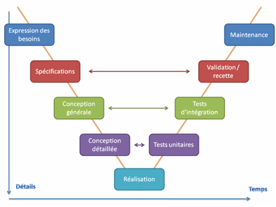
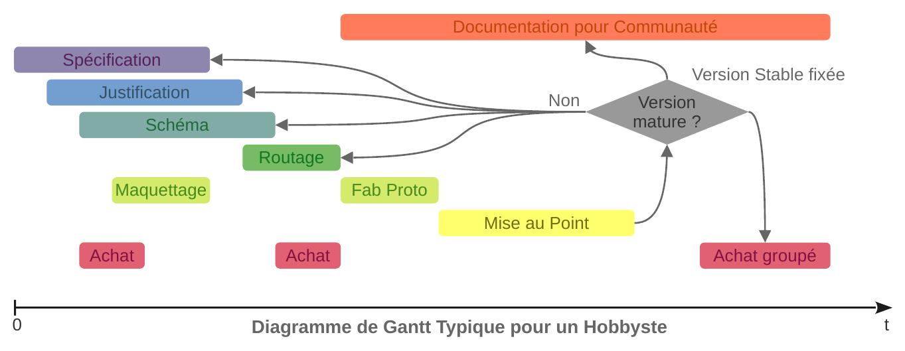

> Date de Création : 23 septembre 2020 
> Auteur initiale : Lilian Tribouilloy 
> Contributeurs : Voir le fichier CREDITS.md 
> Licence : Creative Commonces BY SA 

# Méthodologie de Conception d’un Objet Électronique

## C’est quoi au fait la conception ?

### Concevoir, un état d’esprit

On m’a une fois posé la question, au regard de mes créations, si j’étais un designer. Voici la réponse que j’ai apporté :

> _Suis‑je designer ? Si je me conforme à la définition française, oui. Le truc, c’est que je n’aime pas beaucoup cette définition. Je trouve que ça fait trop formule magique. Dès que je vois un mot anglais, j’ai mon détecteur de langue de bois qui clignote. Je m’explique._
>
> _Le mot designer est un mot d’emprunt de l’anglais qui veut dire concepteur. Comme tu le sais sans doute. Mais les français ont modifié le sens de ce mot pour y ajouter quelque chose de différent. Quelque chose que les anglo‑saxons, me semble‑t‑il, ne mettent pas du tout._
>
> _Conception vient du latin « conceptus » qui signifie « action d’accueillir et de contenir ». Et C’est exactement le même mot en latin pour traduire la période de gestation des femmes. N’est‑ce pas ce qu’elles font pendant cette période pour parler basiquement ? Elles accueillent la « graine » et elles le contiennent jusqu’à ressortir l’enfant. Du reste, aujourd’hui encore dans la langue française, on dit concevoir un enfant. Et même dans la bible, on parle d’immaculé conception._
>
> _Et bien concevoir en technologie, c’est exactement ça mais avec des idées. (Que saurait‑il faire d’autre un homme…?) On accueille une idée. Parfois c’est sa propre idée, parfois c’est celle des autres. (Trop souvent dans l’industrie, c’est celle des autres…) Puis on la mette en gestion un certain temps et selon un processus créatif plus ou moins complexe. Jusqu’à obtenir une chose tangible, quelque chose de réelle._
>
> _Alors, oui, c’est exactement ce que je fais. Et définitivement, je suis un concepteur. Et si on le dit en anglais : I am a designer. Au sens strict._
>
> _Mais c’est un peu court pour décrire l’activité dans son détail. La question est : Je conçois quoi ? Et je mets en œuvre quelle discipline ? Le quoi et le comment est, selon moi, la seule façon de ne pas se tromper dans la description de son métier._
>
> _Alors, posons les choses simplement. Je fais des claviers pour l’informatique. Facile, ça tout le monde aura compris. Et je déploie les disciplines suivantes : électronique, mécanique, programmation, menuiserie, de l’ergonomie. Et quoi d’autre ? Quelle est donc cette substance subtile qui tend à identifier une esthétique. Et peut‑être pour certain une émotion ?_
>
> _Je ne vois pas ce que cela pourrait être d’autre que de l’art. Ou peut‑être de l’artisanat à la limite. Il me semble que c’est bien cela qui est ajouté en plus dans le mot designer à la française. Et à l’italienne aussi d’ailleurs._
>
> _La distinction entre art et artisanat est relativement tardive. Elle date de la Renaissance. Cette distinction est apparue en Italie au moment précis où un petit groupe de gens est devenu très très riches. L’époque des grands explorateur, Marco Polo… Et la naissance des banques modernes. Et où ils ne savaient plus comment afficher, affirmer, leur distinction sociale. Alors ils ont demandé à avoir des choses, même inutiles, que personne d’autre pouvait se payer. L’art est né de cet acte d’orgueil._
>
> _La différence entre art et artisanat est très culturelle. Et il existe encore des cultures humaines où on ne fait pas la distinction._
>
> _Et c’est pour cela, que je tiens à préciser que dans ce que je fais il y a un peu d’art, de l’art utile. Et c’est là un jugement moral et une philosophie que j’assume._

Aussi, il subsiste dans l’acte de création quelque chose de mystérieux. Quelque chose qui dépose la simple raison. Aussi m’est‑il impossible de vous apprendre comment trouver l’idée d’un objet. Je ne peux que vous conseiller de bien prendre le temps de mûrir l’idée en vous et de passer le plus rapidement possible à l’expérimentation. D’écouter ce que les gens vous disent, tout en se méfiant de ce que les gens vous disent. L’intuition peut dépasser les préjugés.

Une idée n’est rien, seule compte sa réalisation tangible. Le signe quasi certain qu’une idée est bonne, est qu’elle ne vous lâche pas, qu’elle vous hante continuellement. Mais le signe absolument certain qu’une idée est bonne, est qu’elle fonctionne réellement et que les gens l’utilisent.

Concevoir est un exercice de l’esprit particulier. Il a ceci du particulier par rapport à la philosophie et au marketing, qu’il faut faire l’épreuve du réel. Et ce n’est pas une petite chose que de faire l’épreuve du réel. Il s’agit d’être concret. Être concret, c’est 3 choses : _des idées, des matériaux (ou composants) et des outils_. Et il faut répondre à la question suivante. Comment on assemble tout cela **précisément** ? Précisément, ça veut dire qu’on est plus dans le domaine des supputations philosophiques et des spéculations intellectuelles où on raisonne dans l’absolu avec des hypothèses sur la comète. On est plus là pour faire de la science‑fiction. On doit faire quelques choses de réalisable avec les moyens dont on dispose réellement.

Et c’est là une très grande différence entre un « chercheur‑scientifique » et un « concepteur‑technicien ». Bien qu’il existe des chercheurs en technologie. Et il en existe de plus en plus. Précisément, car on finit par trouver des limitations structurelles à nos réalisations à cause des moyens limités dont on dispose. Il m’est arrivé de rencontrer des ingénieurs qui n’arrivaient pas à faire le deuil de ne pas être des scientifiques (c’est courant chez les jeunes qui sortent de l’école). Il est vrai que les écoles forment les gens en sélectionnant ceux qui deviendront des chercheurs. Et ne pas y arriver est vécu comme un échec. Oubliez cela et réjouissez‑vous. Il y a bien des joies à passer du côté de la réalisation concrète et de la créativité. Souvenez‑vous du plaisir que vous aviez enfant à assembler des Légos®. En devenant concepteur, vous allez pouvoir jouer avec des « Légos® high‑tech » super cools.

### Concevoir un produit complet et moderne, c’est mélanger plusieurs disciplines

Un objet électronique complet moderne est toujours constituer d’au moins 3 disciplines : Électronique, Mécanique (au sens large) et Programmation.

Mais il arrive qu’il en compte bien d’avantage comme la chimie, la biologie, la menuiserie, la couture, l’architecture, l’art et que sais‑je encore. Il ne sera donc pas possible d’exposer toutes les techniques ou arts qu’il est possible de mettre en œuvre dans un objet électronique. Pour autant que l’électronique soit réellement au centre de l’objet ou qu’il serait qu’une fonctionnalité discrète.

Nous nous concentrerons donc ici que sur les trois premières disciplines citées.

Doit‑on commencer le travail par l’électronique, la mécanique ou le logiciel ? Tout dépend de la nature du projet. Et du degré d’interaction entre les 3.

Si la mécanique n’est qu’un simple boîtier. Alors l’interaction entre électronique et mécanique sera faible. Il y a dans ce cas assez peu de sujets à aborder : Dimension et encombrement général ; Condition environnementale (température, vibration, étanchéité…) ; Dissipation thermique ; Isolation électrique et sécurité des personnes ; Connectique ; assemblage de la carte et du boîtier. On pourra donc se contrer sur l’électronique en premier. Ce qu’il ne signifie pas que l’on ne peut pas se poser les questions précédentes au fil de l’eau.

Évidement si la mécanique est en fait un objet articulé complexe comme un robot par exemple. L’interaction entre électronique et mécanique sera forte. Et il sera bon de pousser les deux disciplines simultanément ou alternativement. Faire beaucoup d’itération entre les deux permet de limiter les erreurs.

L’interaction entre électronique et logiciel est presque toujours forte sur un objet moderne. Mais tout dépend de la complexité de l’objet. Là aussi, faire beaucoup d’itération entre les deux (ou finalement les trois) permet de limiter les erreurs. Dans l’industrie, on va jusqu’à faire des spécifications d’interface entre le Hardware (électronique) et le software (programmation) pour lever toutes les ambiguïtés. Et il peut y avoir des spécifications d’architecture pour coordonner les efforts des 3 métiers (quand il y en a seulement que 3). Aussi, si vous n’êtes pas tout seul sur le projet, ce qui n’arrive quasiment jamais dans l’industrie contrairement en mode hobby, une bonne communication entre les différents métiers et absolument essentielle à la réussite du projet.

Quoi qu’il en soit vous ne pourrez pas faire l’économie de vous investir sérieusement dans les 3 disciplines (ou plus encore). Et il sera bon de chercher de l’aide dès qu’un blocage se présente. Être concepteur, c’est passé sa vie à apprendre des choses, d’autant que les technologies ne cessent d’évoluer. Il est donc urgent d’apprendre à apprendre.

Les fablabs, les makerspaces ou les hackerspaces ou peu importe comment on les appelle, trouvent là tous leurs intérêts…

### Doit‑on Concevoir Seul ou à Plusieurs ?

Comme je le disais en introduction, les objets libres sont un défi organisationnel. Aussi, sur un projet d’envergure, il serait complétement fou de rester seul. D’un autre côté, si on se lance dans la conception d’un objet libre, c’est peut‑être aussi pour trouver de la liberté. Pour trouver enfin la liberté de laisser libre court à sa créativité. Il n’est pas si courant de pouvoir exprimer sa créativité dans le monde du travail salarié. Hors, être à plusieurs peu de faite restreindre à nouveau notre liberté.

Il y a donc là, un jeu de subtil équilibre entre l’ambition du projet, préserver la créativité de chacun et rester cohérent pour avancer. Je n’ai pas de recette magique pour trouver cet équilibre. Je crois qu’il faut agir selon ces envies, faire confiance à son instinct. Il ne faut pas que travailler à plusieurs soit une contrainte invivable. Les disputes, la zizanie est la première cause d’échec dans un projet.

Si vous souhaitez rester seul ou que vous ne parvenez pas à emmener avec vous des gens dans votre projet. Il sera peut‑être raisonnable de revoir vos ambitions à la baisse. L’important est toujours d’avancer et de se faire plaisir. Ça n’empêche pas que vous pouvez trouver des personnes en cours de route. D’une part, quand le projet commence à prendre forme, c’est plus facile d’expliquer le projet et de motiver les autres à vous rejoindre. Mais d’un autre côté, en avançant le projet on fige les paradigmes initiaux du projet. Ce qui peut‑être une difficulté pour ceux qui rentre dans le projet, car il risque de ne pas trouver leur compte au niveau liberté d’action et créativité. Il faut quasiment que les gens « tombent amoureux » du projet pour qu’ils acceptent de travailler gratuitement, et travailler sur le long terme, sur un projet communautaire. Et en plus, il faudrait que la personne soit dans le même état d’esprit que vous pour que vous arriviez à travailler ensemble. La perle rare quoi… 

C’est pourquoi la création d’une entreprise peut résoudre bien des problèmes au niveau du recrutement. Si toutefois, on en a l’ambition et qu’on pense pouvoir trouver une rentabilité avec le projet. Car être rémunérer pour travailler sur un projet passionnant devient acceptable pour beaucoup de gens. Quitte à revoir un peu à la baisse ses ambitions sur le plan de la créativité. En effet en France, des sondages (je vous laisse faire des recherches) montrent que 30% des gens détestent leur travail et que seulement 9% des gens déclarent adorer leur travail. Voilà qui laisse à réfléchir sur les conditions de vie des salariés et de leur épanouissement au travail…

Il me semble important d’insister sur un point. Il y a toujours une part d’intimité dans la créativité qui fait qu’un travail n’est pas, ou peu, partageable (dans le sens du développement collaboratif). Et cela tient à la nature de l’activité. En effet, vous êtes‑vous déjà demandé pourquoi un roman n’est jamais écrit à plus de **1** auteur ? Cela tient précisément au degré d’intimité de l’exercice de l’écriture. Devoir discuter du choix de chaque mot et de chaque adjectif à plusieurs et ceci sur 300 pages. C’est mission impossible. Avec une telle contrainte de devoir écrire un roman à deux, même les gens plus calmes s’engueulent au bout de 2 jours.

C’est pourquoi dans les milieux artistiques, la créativité collective n’est pas si utilisée que cela. Dans un orchestre symphonique, il y a toujours un seul chef d’orchestre, jamais deux. De même, en dance, il y a un seul chorégraphe. Au théâtre, il y a un seul metteur en scène. En BD, il y a soit un auteur qui fait tout, soit un dessinateur et un scénariste, avec éventuellement un coloriste. Mais les rôles sont bien répartis. Au cinéma, il peut y avoir une très grosse équipe, toujours bien hiérarchisée, mais il y a toujours un seul réalisateur, avec éventuellement un seul auteur qui travaille en étroite collaboration pour l’adaptation. (Voilà pour moi, la raison profonde du piètre scénario de la troisième trilogie Star Wars…) 

C’est pourquoi, je pense qu’il existe toujours, et selon le type de discipline (même dans les disciplines techniques où il y a moins d’affect à priori), une dimension maximum de l’équipe à partir de laquelle ça ne fonctionne plus. À partir de laquelle le rendement s’écroule dramatiquement. C’est pourquoi, il est important de bien répartir les rôles pour que les gens de se marche pas dessus. Et c’est pourquoi, les organisations hiérarchisées sont si courantes. Cela me semble être une vérité anthropologique. Une limitation humaine à l’origine de bien des maux. Mais je ne voudrais pas me perdre dans trop de philosophie ici…

Quoi qu’il en soit vous êtes les seules à pouvoir choisir comment manager (pour employer un mot barbare) un projet. Personne ne peut faire les choix fondamentaux à votre place. Mais garder à l’esprit qu’il est très important de faire ces choix. Ne pas faire ces choix et laisser courir une ambiguïté à ce sujet, vous mènera immanquablement à des déconvenues le jour où vous devrez collaborer avec quelqu’un.

---------------------------------------------------------------------

## D’abord un peu d’Organisation

### Un travail de longue haleine

Concevoir une carte électronique peut‑être un long travail. Surtout si on veut le faire bien et le documenter correctement pour le partager. C’est pourquoi il est important de bien s’organiser et d’être honnête avec soi‑même sur notre capacité de travail.

Une mauvaise organisation est une des premières causes d’échec d’un projet. Il est d’autant plus difficile de s’organiser que l’on travaille à plusieurs. C’est pourquoi même dans l’industrie les équipes de développement, pour un projet donné, sont relativement petites, rarement plus de 12. C’était d’ailleurs le chiffre que refuser de dépasser Steve Jobs. Même pour un produit aussi complexe que l’iPhone !

Quand on travaille à plusieurs, il est très important de bien définir le rôle de chacun. Être à deux sur le même stylo est la première cause d’engueulade dans un groupe et la première cause de l’échec du projet.

Dans l’industrie, il existe de nombreux outils pour manager un projet : Mantis, Jira, ERP, Kanban, Management des exigences, Doors, ReqTify, planning, diagramme de Gantt, Réunions, Reporting, Revu de conception, Revu des coût, Cycle de développement en V, processus qualité… Trop de rigueur tue le désir, faire un projet en mode hobbyste doit rester un plaisir.

Pour un projet hobbyste, je recommanderai la plus grande simplicité possible. Une simple liste d’actions peut parfois suffire. À vous de définir vos outils de communication. Mais un dossier de partage, ou mieux une gestion de type GIT est souvent indispensable. Faite vous votre opinion rapidement sur les outils et imposait les en commun accord.

### Proposition d’un Dossier d’Étude

Avoir un dossier projet bien rangé pour pourrait sembler être futile ou pourrait nous faire passer pour des maniaques. Mais en fait, bien ranger le dossier, c’est aussi organiser sa méthode de travail, structurer les tâches à faire, une liste de tâches sans date qui ne dit pas son nom.

Combien de fois, je suis tombé sur des projets sur GitHub ou GitLab, sans comprendre comment fonctionnent leurs sources. Quoi est où ? etc… Bien structurer le dossier D’étude, c’est aussi permettre à d’autres personnes de devenir des contributeurs du projet plus facilement.

C’est pourquoi, il m’est parût pertinent de proposer une manière de ranger un projet. Je pense qu’une bonne façon de s’y prendre et de s’organiser par métier, puis par type d’actions fondamentales dans le deuxième niveau hiérarchique.

Dans le dossier « Template_Dossier_Projet », je propose non pas un dossier template, mais deux dossiers templates. Le premier appelé « version débutant » et le second appelé « version rigueur ». Pourquoi ? Car je pense, comme je l’ai précisé en introduction, qu’une méthode de travail, c’est quelque chose qui se construit dans le temps. Que ça ne sert à rien d’imposer d’emblée trop de complexité. Ces deux versions sont comme les deux points d’une trajectoire. Ainsi un débutant pourra commencer tranquillement par la « version débutant » ; puis au fur et à mesure que les choses apparaissent, il pourra aller chercher dans la version rigueur les éléments dont il a besoin. On comprend mieux les choses par l’expérimentation que par un cours magistral abstrait.

Dans la version rigueur, vous trouverez aussi des fichiers templates pour différentes choses, comme par exemple une base de données pour les composants, ou un fichier pour faire une BOM (Bill of Material = nomenclature composant), une spécification template, un fichier pour calculer la fiabilité. Et plein d’autres choses utiles.

Les deux versions ont les dossiers suivants en tête, voici à quoi ils servent :

* __00_Management__ : Ce dossier n’a pas nécessairement vocation à être partagé au grand publique. Il sert surtout à l’équipe de développement pour s’organiser.
* __01_Système__ : Les éléments qui sont transverses à plusieurs métiers. Et en particulier, la spécification du produit et l’architecture du produit.
* __02_Mécanique__ : Dossier d’étude pour le métier mécanique.
* __03_Électronique__ : Dossier d’étude pour le métier électronique.
* __04_Programmation__ : Dossier d’étude pour le métier programmation.
* _On pourra intercaler d’autres disciplines le cas échéant._
* __XX_Fabrication__ : Ce dossier est destiné à celui qui veut simplement fabriquer le produit sans se préoccuper de l’étude. Il est un peu l’équivalent de l’onglet « Téléchargement » pour un logiciel libre.

On trouve ensuite dans chaque dossier, d’autres dossiers qui correspondent aux étapes fondamentales de conception. Vous trouverez un petit « readme.md » pour comprendre à quoi sert ce dossier. Lire ensuite les paragraphes « Conception » qui suivent pour comprendre comment tout ça s’articule.

### Cycle de Développement en V et Critique du Processus Industriel

Dans ce paragraphe, je détaille les grandes lignes du processus industriel pour mieux mettre en lumière ce qui applicable ou pas pour un hobbyste. Et ainsi expliquer qu’il est possible de faire les choses plus simplement.

#### Description du Cycle de Développement en V Industriel

Dans l’industrie, le mot conception est substitué aux mots « processus de développement ». Et des théories émanant des qualiticiens donne le jour à une choses que l’on appelle cycle de développement en V (ou en W). 

0. __ÉTUDE DE MARCHÉ :__ Il s’agit de l’étape commerciale en amont qui doit définir le besoin client et l’adéquation avec une solution que l’on appelle produit (ou service dans certain cas). Je ne parlerai pas dans ce document de ce qu’il faudrait faire à cette étape. On peut pour faire émerger l’idée initiale s’appuyer sur la méthode du [design thinking](https://en.wikipedia.org/wiki/Design_thinking).
	
	
1.  __SPÉCIFICATION :__ Fixer sur le « papier », la définition du produit. Dans l’industrie, on découpe toutes les caractéristiques en petits éléments, qu’on appelle « exigence ». Ainsi, on parle de management des exigences quand on mette en œuvre des actions pour s’assurer que toutes les exigences sont tenues une par une. Ces exigences sont numérotées pour être tracé dans une base de données. En particulier, le cahier des charges en amont est décliné en des spécifications métiers, puis des documents de justification théorique puis des documentations de vérification expérimentales. On parle alors d’une architecture documentaire. Dans cette architecture tous les éléments sont numérotés pour créer des liens entre spécification produit, les spécifications métiers puis les différents types de justification. On parle de « couverture des exigences ».
	
	
2. __JUSTIFICATION :__ Le cœur de l’étude, mettre en confrontation ce qu’on a imaginé et ce qui est réellement possible selon les technologies disponibles. Il s’agit aussi, dans un document que l’on appelle parfois « DJD, dossier justificatif de définition », de clarifier, d’expliciter tout ce qui est de l’ordre l’implicite et d’écrire tout ce qui est rester dans le domaine de tacite. Il faut remettre en cause les incohérences de la spécification pour aboutir à une spécification plus précise. Il s’agit aussi et surtout de définir la solution technique et expliquer le choix technique d’une part. Et d’autre part, il s’agit de prouver théoriquement que la solution fonctionne et répond parfaitement à l’exigence.
	
	
3. __SCHÉMA :__ Dessiner concrètement le résultat de l’étude. C’est là qu’on fixe la solution technique avec la plus grande précision. Quel composant est connecté où et comment ? Et on donne la liste des composants nécessaires. On appelle cette liste une BOM ou une nomenclature.
	
	
4. __ROUTAGE :__ Dessiner le circuit imprimé et prendre en compte les contraintes liées au processus de fabrication d’un PCB. Le schéma qui est encore une certaine abstraction des choses et alors réalisé physiquement.
	
	
5. __FABRICATION DU PROTOTYPE :__ Prototype destiné au développement. Ce prototype peu tout de même être fabriquer industriellement ou pas selon le degré d’avancement. On parle d’industrialisation progressive ou processus d’industrialisation.
	
	
6. __VÉRIFICATION :__ Mise au point de tous les blocs fonctionnels unitairement. C’est le moment de vérité pour le concepteur. On vérifie point par point que tout fonctionne comme attendu et selon toutes les conditions, conditions climatiques notamment. Il est quasiment impossible de faire tout bon du premier coup. Aussi les erreurs (problème, bug ou défaut) sont tracées dans un outil de suivi (par exemple, Mantis Bug Tracker ou Jira). Le traitement des défauts pourra se faire selon une méthodologie [8D](https://fr.wikipedia.org/wiki/8D). On aura consécutivement à la résolution des problèmes, une liste de solution à appliquer qui donneront lieu à un nouveau prototype. Et on recommencera le processus.
	
	
7. __VALIDATION :__ Validation fonctionnel de l’ensemble et validation de la cohérence documentaire. Vérification de la couverture des exigences. Même chose qu’à l’étape de Vérification, mais au niveau global produit. On pourra parler aussi de validation au niveau système qu’en le produit s’insère dans un ensemble plus grand. On parle de tests d’intégration système.
	
	
8. __QUALIFICATION :__ Respect des Normes, standards et Réglementations. Dans l’industrie, c’est souvent une équipe à part entière qui s’occupe de cette étape. Les normes forment un véritable labyrinthe documentaire à décliner selon tous les pays dans lesquels on souhaite vendre le produit. Cette étape donne lieu à des tests spécifiques qui visent à vérifier par exemple : la CEM (compatibilité électromagnétique), la tenue au ESD (décharge électrostatique), la tenue aux flammes, la robustesse dans les conditions climatique, vibratoire ou choc mécanique, le respect des standards de radiocommunication…
	
	
9. → _Puis on réitère entre 1 et 8, jusqu’à ce que tout soit OK._ ↺
	
	
10. __FABRICATION EN SÉRIE :__ La conception est terminée. Il s’agit maintenir de fabriquer efficacement le produit en masse. L’action en amont de l’industrialisation doit permettre de bien faire le passage de relais entre le monde de la conception et le monde de la fabrication.

Ce workflow (flux de travail) est écrit ici du point de vue de l’électronicien. Du point de vu du mécanicien et du codeur, les choses se déclinent différemment aux étapes 3 à 6.

Pour le mécanicien, on a en 3 : le dessin en 3D. Et en 4 : les projections en 2D et les plans de fabrication. Et en 6, les tests de vérification sont de nature différente de l’électronicien.

Pour le codeur, les étapes 3 et 4 sont quasiment confondues dans une étape de codage / débeugage (on parle de α‑test). En 5, il y a simplement compilation du code et remise de master. Master, ça veut dire figer une version qu’on estime suffisamment mature pour être livrée aux utilisateurs. En 6, on a une vérification strictement fonctionnelle qui peut être faite par des tiers personnes ou les utilisateurs eux‑mêmes. On parle de β‑testeurs.

#### Critique et ce qui se Pratique en Condition Réelle

Bien tout cela semble parfaitement logique. Et il l’est dans les grandes lignes. Il introduit pourtant une idée totalement fausse qui est que tout se déroulerait linéairement dans le temps. Je connais aucun concepteur sérieux qui travaille exactement dans l’ordre des actions décrites précédemment. Je m’explique.

L’image ci‑dessus décrit un cycle en V tel que typiquement réalisé dans la vie réelle pour un concepteur électronique. On commence bien par une spécification, mais très rapidement vient se positionner en parallèle l’action de justification, puis peu de temps après se positionne l’action d’écriture du schéma. Et il est fortement recommandé de faire beaucoup d’itérations entre ces 3 éléments (Spéc / Justif / Schéma) pour converger efficacement vers une solution. Plus on prend le temps de bien se poser toutes les questions pour ces 3 éléments, et moins on aura d’erreurs au moment des vérifications, validations et qualifications. Et il faut garder en tête que ces erreurs peuvent vous coûtez chers. Pas seulement en argent, mais aussi en temps. Par exemple, si on se rend compte que l’architecture du produit ne permet pas le répondre au besoin, c’est la catastrophe. Il faut tout recommencer. Et ça peut‑être 6 mois ou 1 an de perdue.

Il y a ensuite un biseau entre schéma et routage. Dans l’industrie, le routage est souvent réalisé par une équipe spécialisée. Il faut alors réaliser une spécification de routage en bonne intelligence entre les deux équipes. Il n’est pas complètement impossible de trouver des erreurs sur le schéma à cette étape. Et on peut aussi laisser des degrés de liberté au routeur pour faciliter le routage. Par exemple, inversion de pins sur des fonctions équivalentes.

Mais sur des fonctions complexes le biseau schéma / routage peut aller plus loin. En effet, pour concevoir une fonction RF (radiofréquence), il faut carrément réaliser parallèlement, simulation (donc justification), schéma et routage. Car dans le domaine radio, un bout de piste devient équivalent à un composant à part entière, avec par exemple une impédance ou un couplage particulier.

Puis il y a un biseau entre vérification unitaire, validation fonctionnel ou système et qualification.

Enfin, les actions d’achat et d’industrialisation arrive de façon ponctuelle à des moments clés. Les achats au début pour chiffrer la solution ou le choix des composants les moins chers. Un bon suivi du coût doit se faire un amont, pas quand on a fini de travailler. Il n’est pas question de recasser le produit sur la ligne d’arrivé. De même, l’industrialisation doit intervenir pendant le choix technologique pour s’assurer qu’on arrivera à fabriquer industriellement le produit à la fin. Industrialisation également au moment de la réalisation du routage et la conception de la mécanique pour vérifier que tout se fabrique correctement selon les outils dont on dispose.

Pendant la fabrication des prototypes et à la fin du processus de développement, l’industrialisation vérifie que tout se fabrique bien correctement et qu’on sait bien vérifier le bon fonctionnement du produit fabriqué. Les achats chercheront à vérifier qu’on sait tout acheter en quantité suffisante et au meilleur coût. Et aussi éviter les pénuries de composants. On pourra pour cela avoir une stratégie de double‑source. C’est à dire des références chez plusieurs fournisseurs et/ou fabricant qui sont équivalents techniquement. Il peut aussi y avoir une gestion des obsolescences de composants.

#### Adaptation pour un Hobbyste

Alors comment faire pour un hobbyste ? Ayez confiance en vous. Ne vous laissez pas impressionné par toutes ces étapes. Gardez votre bon sens à chaque instant. Éliminez toutes les actions qui n’ont de sens que dans un cadre professionnel rigoureux. Soyez au clair avec vos ambitions. Ne vous laissez pas embarquer dans un planning trop précis. Les plannings sont des tue‑l’amour. Du reste, ils ne marchent jamais (même dans le cadre professionnel !). Laissez‑vous guider par vos envies. Concevoir doit rester un plaisir. (Sans jeu de mot graveleux, bande de petits coquins…)

Le processus de développement est également simplifié, et peut ressembler à ceci :

En revanche, et c’est là toute la difficulté, il faut sélectionner les actions essentielles qui vous permettrons d’arriver à bon port. Je vous propose dans les chapitres suivants les actions qui me semble les plus importantes. Mais comme je le disais en introduction, il vous faut faire des choix en fonction de votre niveau et de vos ambitions. La méthode que je propose ici est (je l’espère) conçu pour que vous ajustiez par vous‑même votre méthode de travail progressivement à mesure des expériences. Mais, soyez bien conscient que personne ne peut placer le curseur entre rigueur et réalisme à votre place. Vous devez rester maître de votre propre méthode de travail.

Ne vous mettez pas la pression. Après tout, ne pas arriver tout à fait au bout n’est peut‑être pas si grave, si votre but et simplement d’apprendre. Et à n’en pas douter, vous ferez mieux la prochaine fois. Apprendre est déjà en soi une noble ambition.

Je recommanderai également d’adapter le processus de manière à favoriser le développement communautaire. Au lieu de penser fabrication série, on pensera documentation accessible aux utilisateurs pour qu’il puisse soit tous fabriquer eux‑mêmes soit assembler des modules tout fait qui aurait été fait fabriquer par votre groupe associatif ou entreprise. Le montage en kit doit être favorisé. On peut aussi imaginer s’organiser pour faire des achats groupés pour limiter le coût d’achat pour tous. L’impossibilité de mutualiser les coûts et de faire de gros investissement est une raison qui fait qu’un objet libre est souvent (mais pas toujours) plus chers qu’un objet du commerce classique. L’utilisateur doit l’accepter et ne plus se voir comme un consommateur, mais comme contributeur plus ou moins actif de la solution communautaire. Il y a un échange équitable entre les deux parties dont on ne connait plus très bien où se situe la frontière. Il s’agit là d’un véritable nouveau contrat moral inédit qu’offre les objets libres. Mais nous en reparlerons au chapitre suivant. 

---------------------------------------------------------------------

## Du Bon Usage du Prototype

### Cassons les Idées Reçues

#### Pour en finir avec les Acronymes

POC, MVP, modèle A puis B puis C, Ramp‑up model, prototypage (rapide ou pas), maquettage, design thinking, lean start‑up…

La littérature technique et managerialle regorge de mot barbare qui embrouille la vision de ce qu’est un prototype et à quoi il serve. Et c’est bien dommage, car un prototype est un outil essentiel pour un concepteur. POC (Proof Of Concept ou preuve de concept) est sensé servir à vérifier la pertinence technique et la potentialité de la solution. MVP (Minimal Viable Product ou produit minimum viable) est sensé servir à vérifier que le produit dans sa version essentielle (bien qu’incomplète) va rencontrer un succès auprès de l’utilisateur final.

Le problème de ses mots, c’est qu’ils font une pré‑supposition sur ce dont à quoi est sensé servir un prototype. Une personne (qui n’a peut‑être jamais rien conçu de sa vie) est en train de vous expliquer comment travailler. Hors, je me suis déjà expliqué en introduction sur le faite que j’étais contre les méthodes imposées de façon autoritaires et qu’il fallait laisser le concepteur choisir sa méthode et ses outils de travail. Ces gens, qui se croient bienveillant, ne se rendent pas compte de ce que cela à de contre‑productif. Et ils ont qui plus est, une vision limitée de ce qu’est un prototype. POC = prouver que ça marche. MVP = prouver que ça va se vendre. Hors, un prototype peut servir à des choses bien plus subtiles que cela. Mais nous allons y revenir…

#### Critique de la définition de l’OMC

Voici un fameux exemple de gens qui n’ont jamais rien conçu de leur vie qui se permettent de vous expliquer votre travail. (Mais c’est là sans doute un effet psychologique bien connu.)

L’OMC (Organisation Mondial du Commerce) a donné une définition de ce qu’est un prototype à des fins de promouvoir l’innovation. (Non, mais de quoi je me mêle. Est‑ce que je me permets de leur expliquer ce que c’est une loi ? … ) La voici :

> « Un prototype est un modèle original qui possède toutes les qualités techniques et toutes les caractéristiques de fonctionnement du nouveau produit. » (…) (OCDE, 1993, alinéa 115, p. 46).

Voyez‑vous le problème ? Ils sont en train de dire que le prototype a déjà toutes les qualités d’un produit fini. Ils veulent la charrue avant les bœufs. Hors, un prototype ce n’est précisément pas cela. Et je regrette que Wikipédia propage cette définition. (Suis‑je le seul, au regard de cette définition, à me faire l’image de la caricature du gros patron avec un fouet qui hurlent : « Plus vite fainéant » ? C’est tellement insupportable…)

#### Étymologie du mot Prototype

Alors revenons un instant à la base. J’aime l’étymologie car ça fait ressortir le vrai sens caché et oublié des mots.

**Prototype**, emprunté (1552) du bas latin _prototypos_ « forme primitive », lui‑même emprunté du grec tardif _prôtotupos_ « primitif, le premier type ». Ce mot grec agglutine le mot _prôto_ qui veut dire « premier, celui qui est en tête » et le mot _tupos_ qui donne en latin (1330) _typus_ qui signifie « image, statue, modèle ». _Tupos_ en grec est un mot polysémique qui est à l’origine un terme technique désignant l’empreinte en creux ou en relief que laisse la frappe d’une matrice. _Tupos_ prend d’ailleurs le sens de « caractère d’imprimerie » (1545) près d’un siècle après l’invention de l’imprimerie occidentale par Guttenberg. (Sombre histoire que celle de Guttemberg. Qui résonne en moi qui conçoit des claviers et qui devrait résonner chez tout entrepreneur en herbe. Voir ). _Tupos_ donnera, entre autres, « typographie » en français et “ to type ” en anglais. _Tupos_ est dérivé du verbe _tuptein_ qui signifie « frapper » et on peut même rattacher une origine indoeuropéenne _°(s)teu_ qui veut dire « frapper » également. D’où également le mot « taper » en français, double sens de frapper et taper à la machin à écrire (ou à l’ordinateur).

Ce n’est ici qu’un résumé de ce que j’ai trouvé dans l’excellant « Dictionnaire Historique de la Langue Française » de Alain Rey (RIP) et son équipe. Mais, il n’est donc pas absurde de dire que prototype a pour signification cacher : « le première caractère écrit », ou « la premier lettre d’une histoire ». Et si j’ose un trait d’esprit, on peut opposer « prototype » à l’expression « avoir le dernier mot ». Avec un prototype ont écrit _son_ histoire, il ne s’agit pas de conclure. 

> «_L’ineptie consiste à vouloir conclure. Oui, la bêtise consiste à vouloir conclure. Quel est l’esprit un peu fort qui ait conclu, à commencer par Homère ? Contentons-nous du tableau, c’est ainsi, bon._», disait Gustave Flaubert.

#### Les Prototypes, Simplement des Étapes dans la Conception

Un prototype, c’est simplement le début de quelque chose. De quoi ? Vous verrez bien, ne soyez pas si pressé. Laissez de la place pour la [sérendipité](https://fr.wikipedia.org/wiki/S%C3%A9rendipit%C3%A9).

D’abord, il n’y a jamais un, mais des prototypes sur le chemin de la conception. Chaque prototype marque une étape dans votre réflexion. Il peut, à ce moment venu, servir à quelque chose de précis et subtile. Écrivez au moins pour vous même (et en français dans le texte, s’il vous plait, arrêtez de vous la « péter » avec des acronymes en américains) un petit texte qui décrit vos objectifs et vos interrogations.

Par exemple, il peut s’agir d’apprendre quelque chose de théorique ou non, d’apprendre la programmation ou apprendre à se servir d’un framework informatique, de s’approprier une nouvelle technologie, d’évaluer la performance d’un composant, de vérifier que vous allez pouvoir insérer un élément dans votre objet, de vérifier que ça marche comme vous souhaitez, de faire un choix entre une solution A et une solution B, de tester la réaction des gens, de voir si les gens aime l’objet, si c’est pas trop compliqué pour eux, si la solution résout bien le problème énoncé, que l’on arrive à le fabriquer avec les outils à notre disposition, à se rendre compte qu’on a encore besoin de monter en compétence et qu’on a peut‑être besoin d’aller chercher de l’aide, et il peut bien sûr correspondre aux étapes « vérification », « validation » et « qualification » décrites plus haut.

J’en passe et des meilleurs. Les prototypes sont vos amis pour passer du monde des idées, au monde de la réalisation. Pour passer de la théorie à la pratique. Il est bon d’en faire usage tout au long de développement et dès qu’une interrogation apparaît. C’est souvent un amical juge de paie. Dans votre petit labo perso, vous n’êtes plus à l’école, il n’y a pas de professeur qui va vous expliquer ce qui est vrai et ce qui est faux. Les prototypes vont vous permettre de répondre vous‑même à la question.

Bien sûr, les prototypes vont se complexifier au fur et à mesure. Et plus vous allez avancer progressivement vers un produit fini (voir vers un produit fabricable industriellement), et plus les questions vont être précises et variées. Et qui plus est, plus vous voulez un haut niveau de qualité, et plus il faudra faire de prototypes. À vous de voir jusqu’où vous voulez allez.

### Réaliser des Prototypes

#### Des Matériaux, des Outils, des Expériences…

#### Les Prototypes Électroniques

Le prototypage rapide pour l’électronique a connu un développement extraordinaire. Notamment avec l’avénement de carte toute faite et prête à l’emploi comme Arduino, Rapsberry Pi, Micro:Bit, Adafruit et plein d’autres.

#### Un Processus Itératif

---------------------------------------------------------------------

## Concevoir la partie Électronique

### Vue Global sur un Flux de Travail Simplifié

Voici une vu d’ensemble sur le procéssus de développement de la partie électronique que je vous propose dans ce chapitre.

0. IDÉE
1. SPÉCIFICATION / JUSTIFICATION (On abandonne l’idée qu’on peut séparer les deux pour simplifier la documentation.)
2. SCHÉMA
3. ROUTAGE
4. FABRICATION DU PROTOTYPE
5. MISE AU POINT 
→ _Réitération des étapes 1 à 5 jusqu’à ce que tout soit OK._ ↺
6. DOCUMENTATION POUR LA COMMUNAUTÉ

### Une Liste de Questions à se Poser

La liste suivante regroupe des actions essentielles, mais elles ne sont ni exhaustives, ni limitatives. À vous de vous faire votre propre opinion. Au cours de la conception, il y aura sûrement des sous‑tâches, qu’on ne peut pas prévoir à l’avance, qui vont apparaître.

0. __IDÉE__
	La créativité est une chose mystérieuse. Personne ne peut prétendre donner une méthode générale pour trouver des idées. Il faudra creuser au bout de vous‑même et vous faire confiance. Laissez‑vous guider par vos envies.

> Les points 1, 2 et 3 peuvent (devraient) être faite en parallèle par un processus itératif.

1. __SPÉCIFICATION / JUSTIFICATION__
	* Le but d’une spécification est de poser le besoin, idée, envie. Faites‑vous au moins pour vous même un petit texte pour expliquer ce que vous voulez faire. Faire des petits dessins. Faire une liste des caractéristiques essentielles.
	
	* Essayer d’identifier clairement quel est le problème et comment on cherche à le résoudre. (Le couple problème / solution.)
	
	* Faire un synoptique (schéma de principe sans les alimentations). Ce qui va permettre de clarifier l’architecture de l’objet. Il doit faire apparaître des détails, des fonctions nécessaires auxquelles vous n’aviez pas pensé au début. Refaire le synoptique jusqu’à ce qu’il semble complet.
	
	* Faire la liste de tous les sous‑blocs fonctionnels. Cette liste pourra servir à toutes les étapes de la conception. Une sorte de check‑list pour chaque question : alimentation, référence composant, justification, routage… On peut également identifier s’il y a des parties optionnelles au projet. Il faut peut‑être pouvoir imaginer des extensions futures.
	
	* Vous pouvez éventuellement classer les sous‑blocs fonctionnels par catégorie : alimentations, cœur numérique, entrées, sorties, interfaces homme / machine, capteurs, communications filaires, radiocommunications… Cela permet de mieux planifier le travail ou de partager le travail dans une équipe.
	
	* Pour les fonctions principales fixer les choix de composants. Si ce n’est pas claire, ne pas hésiter à faire de petite maquette pour éprouver la pertinence de la solution. Par exemple, est‑ce que l’accéléromètre sera assez précis ?
	
	* Le microcontrôleur est un composant qui ne sera pas interchangeable, il faut être certain qu’il pourra prendre en compte toutes les fonctions. Pour cela faire la liste de tous les signaux à brancher et mettre en face les options d’affectations du microcontrôleur.
	
	* Quand les choix des composants principaux sont arrêtés. Acheter ces composants car il risque d’y avoir du délai. Il ne s’agit pas d’acheter toute la BOM. Ce n’est pas possible car la conception ne fait que commencer.
	
	* Faire un bilan de consommation. Les tensions nécessaires. Les courants pour chaque fonction. Quelle est notre source d’énergie et comment la gérer ? Est‑ce qu’il y a des priorités nécessaires pour la séquence d’allumage (souvent nécessaire pour le CPU) ? Est‑ce qu’on a besoin d’une alimentation permanente pour les fonctions en mode veille ?
	
	* Quelles sont les contraintes environnementales (température, étanchéité, vibration) ?
	
	* Si on veut vendre le produit, il est absolument nécessaire de se demander quels sont les normes CEM (Compatibilité ÉlectroMagnétique) à respecter. L’amateur pourra se passer de cette étape.
	
	* Avons‑nous une contrainte sur la durée de vie. Si oui calcul de fiabilité et AMDEC nécessaire. Étape nécessaire dans les milieux professionnelles. C’est nécessaire aussi si vous êtes sensible à la lutte contre obsolescence programmée. Cette étape n’est pas nécessaire sur les premiers prototypes.
	
	* Y‑a‑t‑il une contrainte de sécurité pour les personnes ? Analyse Safety nécessaire et AMDEC. Quelles sont les fonctions de sécurité à ajouter ou à mettre en redondance ? Étape nécessaire dans les milieux professionnelles. Mais faites tout de même attention à vous et les autres si vous êtes amateur. L’électricité, c’est dangereux, on ne le répète jamais assez.
	
	* Typiquement, ce qui est dangereux : les batteries (risque d’incendie en cas de court‑circuit), les tensions supérieures à 50Vac ou 120Vdc (limite entre la Très Basse Tension et la Basse Tension selon la norme) (risque d’électrocution), les éléments chauffants (risque de brûlure ou d’incendie), les moteurs ou les vérins (risque de mutilation), les produits chimiques nécessaires à la fabrication (risque d’intoxication) …
	
	* Faire une liste des risques projets. Quels sont les inconnus à lever plus tard ?
	
	* Ensuite, il faut développer la solution en levant les ambiguïtés de la spécification. Il faut démêler l’implicite de l’explicite. Et il faut écrire ce qui est tacite.
	
	* Justifier la pertinence de la spécification. Est‑ce qu’on répond de façon cohérente et efficacement au besoin ? (Dans les milieux professionnels on va jusqu’à faire une étude marché ou à soumettre un prototype à un client potentiel.)
	
	* Justifier les choix technologiques
	
	* Vérifier que le coût du produit est raisonnable. (En adéquation avec le business plan pour les professionnels.)
	
	* Justifier théoriquement que cela fonctionne. Par calcul, simulation, ou en mettant en lumière certain point de la documentation technique.
	
	* Si des inconnus subsistent, il peut être pertinent de faire une maquette et des tests pour un sous‑ensemble du produit.
	
	* Cette étude doit aboutir à une spécification plus précise.
	
	
2. __SCHÉMA__
	* Vérifier que l’architecture et les blocs fonctionnels sont OK.
	
	* Faire le cartouche la page et choisir la taille des pages en fonction de la quantité de composant à mettre par page.
	
	* Organiser vos pages pour faciliter la lecture et la maintenance du dossier. Faire toujours une première page de garde pour la gestion des variantes et des évolutions.
	
	* Ensuite il faut organiser le schéma par catégorie de fonction et en fonction de la complexité. En page 2, il est conseiller de mettre les connecteurs qui vont vers le monde extérieur ainsi que les blocs hiérarchiques. Dans les pages suivantes, on a le contenu de ces blocs. Il est préférable de faire une page au moins par catégories de fonctions. 
	
	* Dessiner le schéma.
	
	* Dessiner le symbole (schematic part) des composants manquants
	
	* Numéroter les composants (Référence topologique).
	
	* Lancer l’algorithme de vérification DRC (Design Rule Check).
	
	* Créer une base de données de vos composants.
	
	* Définissez les variantes ou options.
	
	* Associer à chaque composant une empreinte physique.
	
	* Penser à la testabilité ou débeug de la carte.
	
	* Générer la nomenclature des composants.
	
	* Vérifier le prix de la carte.
	
	* Faire l’analyse critique de schéma.
	
	* Corriger les erreurs.
	
	* Générer le fichier .net pour pouvoir commencer le routage.
	
	
3. __Routage__
	* Faire le plan d’interface Méca / PCB pour préciser la dimension et la géométrie de la carte, pour définir la position des vis, des connecteurs, des IHM et des radiateurs ou autres éléments dont il est nécessaire de fixer la position.
	
	* Avec FreeCAD, on peut générer un fichier svg que l’on peut transformer en fichier dxf avec Inkscape. Ce fichier dxf est le format que peut comprendre KiCAD.
	
	* Définir les hauteurs maximales selon la mécanique. Plusieurs zones peuvent être définies.
	
	* Il faut choisir le processus de fabrication. Lequel avait vous accès selon vos moyens. Est‑ce qu’on fait les soudures à la main ? Est‑ce qu’on fait le PCB avec une gravure chimique artisanal, une CNC ou on passe par un fabricant de PCB professionnel, etc. ?
	
	* Cela va fixer la taille des pads de soudure et la précision de gravure et éventuellement le nombre de couche de cuivre auquel on a le doit. Et donc on peut alors écrire une spécification de PCB.
	
	* Définir l’empilage (Stack‑up) du PCB. Le nombre de couche choisi est un compromis entre le prix, la complexité ou densité d’interconnexion et la CEM. L’utilisation des couches doit être défini : plan de masse, plan d’alimentation, les couches signaux…
	
	* En cas de brasure en refusion, il faut lister les composants lourds et décider sur quelles faces ont les mets ou s’il faut les coller avant soudure ou si on les soude à la main (c’est un abus de langage, il faut dire braser).
	
	* Dessiner les empreintes manquantes pour certains composants.
	
	* Définir dans KiCAD, la liste des pistes et des vias.
	
	* Définir le cartouche et la taille des pages.
	
	* Importer le fichier méca au format dxf.
	
	* Fixer les repères pour faire la correspondance entre plan mécanique et le routage.
	
	* Importer le fichier net pour faire le lien avec le schéma électronique.
	
	* Faire le placement des composants, sans les pistes, pour appliquer les différentes contraintes. Et vérifier que tout rentre bien dans le volume définie (penser la surface _et_ à la hauteur).
	
	* Vérifier qu’il n’y a pas de collisions avec la mécanique.
	
	* Dessiner le contour de la carte avec une ceinture de masse pour la CEM.
	
	* Faire le routage à proprement dit. Dessiner les pistes et les vias.
	
	* Éventuellement, modifier le schéma si on trouve des simplifications de routage (ou si on voit des erreurs).
	
	* Dessiner les plans de masse et d’alimentation.
	
	* Faire le remplissage de masse entre les pistes.
	
	* Lancer le DRC (Design Rule Check) pour vérifier le respect des règles IPC.
	
	* Corriger les infaisabilités, erreurs ou autres problèmes de fabrication.
	
	* Ajouter les éléments industriels, n°, mire, espace pour étiquette, méthode de détachement (timbre‑poste, V‑scoring ou usinage) …
	
	* Analyse critique de routage par les paires. Attention à la CEM.
	
	* Faire un 3D du PCB avec composant et le mettre dans le 3D mécanique pour vérifier qu’il n’y a pas de collisions.
	
	* Correction des problèmes.
	
	* Faire la mise en flanc. Combien on fabrique de carte à la fois ? Quel est le sens de convoyage pour la soudure en refusion ou à la vague.
	
	* Générer les fichiers de fabrication : .pos, .drl, .rpt, gerbers
	
	* Vérifier les gerbers avec le visualiseur KiCAD.
	
	* Générer les plans et la spécification PCB (selon le fournisseur).
	
	
4. __Fabrication__
	* Achat des composants (Attention délais)
	
	* Vérifier qu’on n’a pas de composant manquant.
	
	* Récupérer le PCB et vérifier qu’il est conforme à vos attentes (ouverture de vernis, inversion de couches…).
	
	* Éventuellement pour la refusion, vérifier le masque de pâte à braser.
	
	* Pour les pro, vérifier les continuités des pistes avec un testeur type Takaya.
	
	* Brasure des composants.
	
	* Vérifier que tout est correctement soudé.
	
	* Pour les pro, vérifier les caractéristiques des composant avec un testeur type Takaya.
	
	* Séparer les différentes cartes du flanc.
	
	
5. __Vérification unitaire et mise au point__
	* Fabriquer les outils de validation ou de débeug.
	
	* Vérifier les alimentations. Attention à la fumée et les surchauffe.
	
	* Vérifier qu’on arrive à télécharger le logiciel.
	
	* Vérification rapide des fonctions pour avoir un aperçu du bon fonctionnement global.
	
	* Puis vérification détaillée de tous les blocs fonctionnels.
	
	* Vérification de la bonne tenue des performances.
	
	* Vérification de la tenue en température min et max de toutes les fonctions. (Il faut avoir une étuve…)
	
	
> _Les actions qui suivent n’ont de sens que dans un cadre professionnel._
> _Donc à vous de voir si vous voulez allez plus loin._
> _Sinon aller directement à l’étape 6 bis._
	
	
6. __QUALIFICATION__
	* Pour le pro, pour une mise sur le marché, conformité aux standards, aux normes et à la réglementation.
	
	* Tests aux perturbations conduites
	
	* Tests CEM
	
	* Tests ESD
	
	* Tests environnementaux du produit global
	
	* Vérification de la tenue aux vibrations ou chocs mécaniques.
	
	* Tests de vieillissement
	
	* Tests de vérification à la sécurité électrique
	
	* Tests de tenu aux flammes
	
	
7. __VALIDATION__
	* Pour les pro, validation que toutes les exigences sont tenues point par point pour être sûr qu’on n’a rien oublier (management des exigences).
	
	* Vérifier que toute la documentation est complète en cohérente.
	
> Remarques : Il faut réitérer entre 1 et 7 jusqu’à ce tout soit jugé satisfaisant.
	
	
8. __FABRICATION EN SÉRIE__
	* Industrialisation, vérifier que le produit peut être produit industriellement.
	
	* Mettre en place les outils de fabrication industriel.
	
	* Mettre en place les outils de vérification du bon fonctionnement semi‑automatique ou automatique.
	
	* Écrire le document de méthode de fabrication. (C’est le service Méthode qui le fait.)
	
	* Faire lancement de la première série pour vérifier que tout se passe bien.
	
	* Corriger les problèmes.
	
	* Produire en série.
	
	* Emballage du produit.
	
	* Livraison et logistique jusqu’au point de vente.	

> _Cette dernière étape est importante surtout si on s’inscrit dans une démarche de conception d’objet libre. Le but est de faire l’équivalent de l’onglet « Téléchargement » pour un logiciel libre._
> _Plus d’information sur cette démarche dans le chapitre 4 « Démarche Conception Libre »_ 	

6. BIS. __DOCUMENTATION pour la COMMUNAUTÉ__
	* Remettre au clair les éléments essentiels qui permettent de fabriquer.
	
	* Faire la liste des composants et matériaux à acheter. Avec une liste de fournisseur possible, encore mieux, la liste avec plusieurs référence fournisseur possible pour tous les composants. On doit voir clairement combien coût l’objet au total.
	
	* Faire la liste des outils nécessaires à la fabrication.
	
	* Faire un dossier avec tous les fichiers nécessaires à la fabrication de la partie électronique.
	
	* Faire un dossier avec tous les fichiers nécessaires à la fabrication de la partie mécanique.
	
	* Faire un document qui explique très clairement comment on fait pour fabriquer l’objet étape par étape. L’utilisateur doit être capable de voir s’il est possible de faire des adaptations selon les moyens qu’il a à sa disposition.
	
	* Faire un dossier avec tous les logiciels à télécharger dans le ou les microcontrôleurs ou microprocesseur ou autre FPGA ou que sais‑je.
	
	* Faire un document qui explique étape par étape comment télécharger les logiciels et le cas échéant il faut faire les configurations ou les réglages.
	
	* Il faut faire un document pour expliquer comment vérifier le bon fonctionnement. Et si possible, donner une procédure sur comment dépanner.
	
	* Donner un contact pour les questions et pour obtenir un retour sur la satisfaction de l’utilisateur.

---------------------------------------------------------------------

## Concevoir la partie Mécanique

### Vue Global sur un Flux de Travail Simplifié

Voici une vu d’ensemble sur le procéssus de développement de la partie mécanique que je vous propose dans ce chapitre.

0. CROQUIS DU DESIGN
1. PLAN 3D
2. PROJECTION DES PLANS EN 2D
3. FABRICATION DU PROTOTYPE
4. MISE AU POINT 
→ _Réitération des étapes 1 à 4 jusqu’à ce que tout soit OK._ ↺
5. DOCUMENTATION POUR LA COMMUNAUTÉ

### Une Liste de Questions à se Poser

La liste suivante regroupe des actions essentielles, mais elles ne sont ni exhaustives, ni limitatives. À vous de vous faire votre propre opinion. Au cours de la conception, il y aura sûrement des sous‑tâches, qu’on ne peut pas prévoir à l’avance, qui vont apparaître.

0. __CROQUIS DU DESIGN__
	* Faire des croquis pour travailler, donner une première forme à ce que vous imaginez. Il n’est pas nécessaire d’être un grand artiste pour ça. L’important c’est de faire naître l’idée.
	
	* On peut confirmer les choses avec des dessins technique en 2D ou 3D à la main. À la main, pour garder en vitesse, l’idée n’est pas de faire un plan super propre, mais de confirmer la faisabilité.
	
	* Le dessin reste une chose très utilisée par les concepteurs d’objet professionnel. Parfois, ils vont jusqu’à faire des maquettes (même dégeu avec du carton, de la pâte à modeler ou avec des Légos®). C’est plus parlant qu’un dessin si on veut mettre les choses en situation.

1. __PLAN 3D__
	* Il faut transposer ce que vous avez imaginé dans un dessin plus formaté par le logiciel FreeCAD. Ce qui oblige à être concret.
	
	* Identifier les différentes pièces mécaniques qui seront nécessaires.
	
	* Choisir les différents matériaux que vous voulez utilisés.
	
	* Comment on ferra pour assembler les pièces : vis, clips, collage, etc. ?
	
	* Il faut dessiner en gardant en tête quels seront les moyens de fabrication que vous aurez à votre disposition.

2. __PROJECTION DES PLANS EN 2D__
	* Faire ce qu’on appelle une projection en 2D permet de créer les plans qui seront nécessaire à la fabrication.
	
	* Faire les fichiers nécessaires à la fabrication comme le Gcode pour la CNC ou l’imprimante 3D.
	
	* Faire un plan dxf pour importer les dimensions de la boîte et les différentes contraintes dans l’outil de CAO électrique KiCAD.

3. __FABRICATION DU PROTOTYPE__
	* Vérifier que tous les fichiers de fabrication ont bien été générés.
	
	* Assurez‑vous que vous avez tous les matériaux, composants et consommables nécessaires.
	
	* S’il y a des manquants demandez‑vous ce qui peut être fait malgré tout en attendant.
	
	* Organiser votre plan de travail avant de commencer. Il faut avoir les outils à disposition au bon moment.
	
	* Noter toutes les étapes de fabrication au moment où vous les faites pour ne rien oublier.
	
	* La mécanique étant terminé assembler l’électronique à l’intérieur.

4. __MISE AU POINT__
	* Vérifier que le montage de la carte électronique est correct. Toutes les vis sont OK. Les connecteurs sont accessibles.
	
	* Noter au fur et à mesure les défauts ou les voix d’amélioration.
	
	* S’il s’agit d’un objet articulé, vérifier que le mouvement est correct.
	
	* Vérifier les différentes contraintes environnementales.

5. __DOCUMENTATION POUR LA COMMUNAUTÉ__
	* Il s’agit de faire une documentation qui explique comment fonctionne l’objet et les sources de l’objet pour pouvoir garantir une maintenance des problèmes constatés.
	
	* Faire un document qui permet à « monsieur‑tout‑le‑monde » de fabriquer l’objet.
	
	* Faire une procédure de réglage le cas échéant.
	
	* Éventuellement, expliquer comment configurer l’objet ?
	
	* Donner un contact pour les questions et pour obtenir un retour sur la satisfaction de l’utilisateur.

---------------------------------------------------------------------

## Concevoir la partie Programmation

### Vue Global sur un Flux de Travail Simplifié

Voici une vu d’ensemble sur le procéssus de développement de la partie programmation que je vous propose dans ce chapitre.

0. IDÉE
1. SPÉCIFICATION & ARCHITECTURE LOGICIEL
2. CODAGE
3. DÉBEUG
4. VALIDATION FONCTIONNELLE 
→ _Réitération des étapes 1 à 4 jusqu’à ce que tout soit OK._ ↺
5. DOCUMENTATION POUR LA COMMUNAUTÉ

### Une Liste de Questions à se Poser

La liste suivante regroupe des actions essentielles, mais elles ne sont ni exhaustives, ni limitatives. À vous de vous faire votre propre opinion. Au cours de la conception, il y aura sûrement des sous‑tâches, qu’on ne peut pas prévoir à l’avance, qui vont apparaître.

0. __IDÉE__
	La créativité est une chose mystérieuse. Personne ne peut prétendre donner une méthode générale pour trouver des idées. Il faudra creuser au bout de vous‑même et vous faire confiance. Laissez‑vous guider par vos envies.

1. __SPÉCIFICATION & ARCHITECTURE LOGICIEL__
	* Il est fort risqué de partir dans le codage de but en blanc sans avoir réfléchi au préalable. Comme pour l’électronique, il faut ici interroger la spécification et expliciter l’implicite.
	
	* Construire une architecture des fichiers ou fonctions nécessaires et mettre en lumière leurs interactions. La méthode de modélisation UML ([Unified Modeling Language](https://fr.wikipedia.org/wiki/UML_(informatique)) ) peut être d’une aide précieuse.
	
	* Choisir le cœur numérique (MCU, CPU, FPGA ou autres) selon la nature du projet.
	
	* Définissez les outils de débeug dont vous aurez besoin.

2. __CODAGE__
	* Le cœur du travail… Organiser votre travail en sous‑fonctions.
	
	* Commencer le code sur une demo board qui contient le MCU visé en attendant que la carte électronique arrive.
	
	* Préparer le terrain pour transférer ce premier code pour la vraie carte électronique.
	
	* Faire avec l’électronicien une revue des affectations au(x) cœur(s) numérique(s) pour mettre au clair les capacités des micros.
	
	* Passer en revue les mémoires pour vérifier que l’électronique prend bien en compte les besoins logiciels.
	
	* Vérifier que le choix des quartz permet bien de faire le travail attendu.
	
	* Vérifier que l’électronique met bien en œuvre l’accès aux pins de téléchargement et de débeug.
	
	* Lancer vous, pour de bon cette fois‑ci, dans le codage à proprement parler.
	
	* Ne pas oublier de bien commenter le code. Il faut penser à la maintenance du logiciel et à la possibilité de faire entrer des contributeurs dans le projet.

3. __DÉBEUG__
	* En programmation, le cycle en V n’est pas forcément une bonne modélisation du flux de travail. Une méthode de type [Scrum](https://fr.wikipedia.org/wiki/Scrum_(d%C3%A9veloppement)) ou [méthode Agile](https://fr.wikipedia.org/wiki/M%C3%A9thode_agile) est souvent mieux adapté.
	
	* Mettre en place les outils qui permettront de faire des téléchargements régulièrement. Car il y aura une itération très intensive entre codage et débeug.
	
	* Noter les fonctions essentielles dont l’électronicien à besoin pour faire la vérification unitaire et la mise au point. Électronicien et codeur doivent travailler en bonne intelligence. C’est un point clé pour la bonne conduite du projet.

4. __VALIDATION FONCTIONNELLE__
	* Il s’agit de vérifier de façon systématique que toutes les fonctionnalités de la spécification sont parfaitement implémentées.
	
	* Faire les corrections nécessaires
	
	* Faire une livraison de master. Il s’agit de figer une version majeure du logiciel en vue de fixer la solution finale du produit.
	
	* Pour les pro, faire une livraison d’une version de logiciel destinée à la qualification.
	
	* Prendre en compte les remarques et demandes des concepteurs ou des utilisateurs. Et corriger les problèmes résiduels.
	
	* Faire une nouvelle remise de master. Et réitère, ce processus jusqu’à ce que l’on considère le résultat satisfaisant.

5. __DOCUMENTATION POUR LA COMMUNAUTÉ__
	* Il s’agit de faire une documentation qui explique comment fonctionne le logiciel pour pouvoir garantir une maintenance des problèmes constatés.
	
	* Faire un document qui permet à monsieur tout le monde de télécharger le logiciel dans l’objet.
	
	* Faire une procédure de réglage ou de configuration le cas échéant.
	
	* Donner un contact pour les questions et pour obtenir un retour sur la satisfaction de l’utilisateur.
